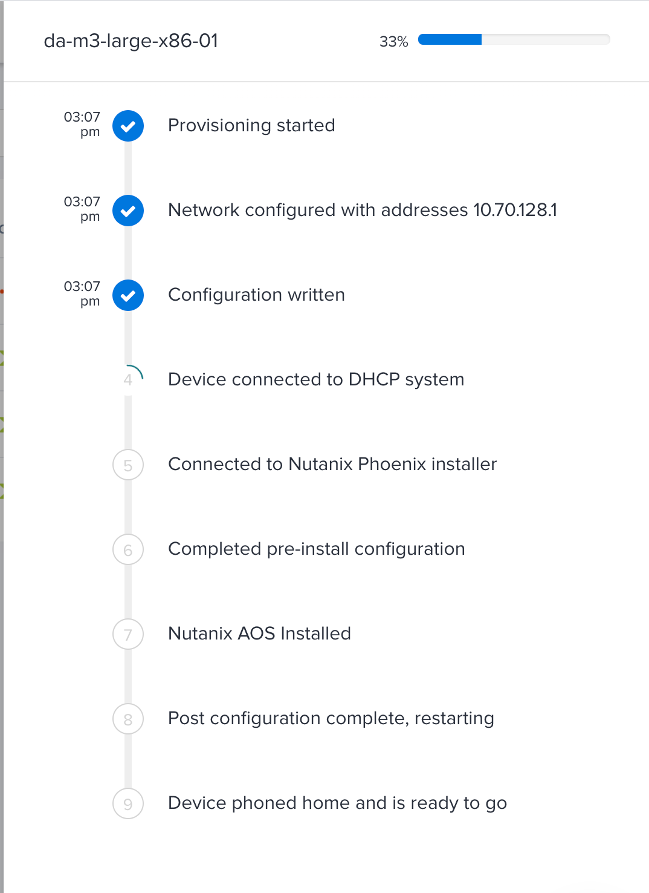
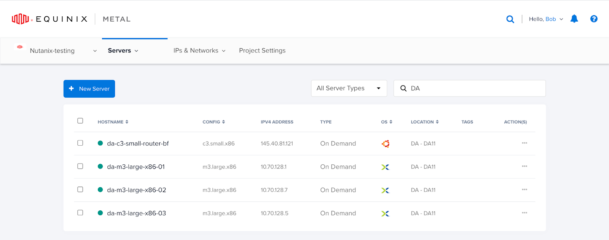

# Nutanix Installation on Equinix Metal

## Overview

This guide describes the installation steps required to bring up a Nutanix cluster on Equinix BareMetal infrastructure.

### Introduction

**Nutanix Cloud Platform** is a modern, software-defined architecture that natively integrates all IT resources to run any application while delivering true consumer-grade simplicity, and drastically reducing deployment complexity. The software stack is optimized and completely scalable to support a wide variety of workloads encompassing private cloud, EUC (End user computing), business continuity, supporting all mission-critical enterprise applications.

**Equinix Metal** provides automated, interconnected, low-latency bare metal-as-a-service that enables digital businesses to scale globally with on-demand infrastructure. Users who want to move from CAPEX hardware solutions, but do not want a traditional cloud provider, can achieve OPEX benefits through Equinix Metal. They retain full operational control over their infrastructure across on-premises, collocated and Equinix Metal-as-a-service.

With Nutanix Cloud Platform supported over Equinix Metal, users get to reap all the benefits of an industry leading hyper converged infrastructure over automated, interconnected, low-latency bare metal-as-a-service.

The server provisioning and network configuration steps that must be performed include:

* Setting up layer 2 networking
* Setting up private network services (Gateway, DHCP, DNS, etc)
* Provisioning the Nutanix nodes
* Configuring networking on the Nutanix nodes
* Creating the cluster

### Layer 2 networking

The Nutanix nodes must run in a private network with layer 2 connectivity. Equinix Metal supports several networking modes such as Layer 2, Layer 3, and Hybrid (both). More information on networking modes can be found at <https://metal.equinix.com/developers/docs/layer2-networking/overview/#layer-2-overview>.

The Nutanix nodes will run in Layer 2 Bonded mode. You will most likely need a gateway node to provide access to other systems not on the layer 2 subnet. Hybrid Bonded Mode is recommended for this node.

### Create a VLAN

Create a VLAN in your project in the Metro where your servers will be provisioned: <https://metal.equinix.com/developers/docs/layer2-networking/vlans/#vlans-on-equinix-metal>

### Private Network Services

The layer 2 network will need services such as a gateway router and DHCP. There are many ways to provide these services. This is out of the scope of this guide.

One way to provide these services is to provision a bastion host that provides these services. This node should be placed in Hybrid Bonded Mode: <https://metal.equinix.com/developers/docs/layer2-networking/hybrid-bonded-mode/#hybrid-bonded-mode>
The layer 2 part of the bond should be attached to the subnet / VLAN where the Nutanix nodes will be provisioned.

This will allow you to set up a gateway between the L3 and L2 networks. You will also need to provide DHCP services on the L2 network.

### Provision the Nutanix Nodes

Next, provision the nodes that will form the Nutanix cluster. Refer to Reserved Hardware deployment: <https://metal.equinix.com/developers/docs/deploy/reserved/#reserved-hardware>

To provision nodes from your reservation follow these instructions: <https://metal.equinix.com/developers/docs/deploy/reserved/#provisioning-from-your-reserved-hardware>

For the Operating System select Nutanix AOS in the OS dropdown. You can provision multiple servers at once and they will provision in parallel.

Once the systems are provisioning you can click on the “clock” icon and see the progress:

<!--progess.png image inlined-->


Below is an image of the provisioned servers. You can identify the servers running Nutanix AOS by the icon in the OS column:



### Post-provisioning

Once Nutanix AOS has been installed and the node has booted, there are post-provisioning steps that need to be run such as installation of AHV Virtualization and starting services. It is important that these steps are completed before rebooting the machine.

To ensure that the post-installation script has completed, SSH into the machine and look for the file `/root/.firstboot`_success. If it is there then the installation is complete and the networking can be changed and the system rebooted.

### Convert the nodes to Layer 2 Bonded

Convert each of the Nutanix nodes to Layer 2 Bonded networking mode: <https://metal.equinix.com/developers/docs/layer2-networking/layer2-mode/#converting-to-layer-2-bonded-mode>

Make sure to add the VLAN that was created earlier. You do not need to change the host networking configuration. This will happen automatically upon reboot.

### Reboot the Nutanix nodes

To reboot a server, click **Server Actions** from the server's Overview. Click **REBOOT**.
The Nutanix nodes will then obtain IP addresses from your DHCP service.

To create the cluster you will need the IP addresses of the Nutanix Controller VMs (CVMs). These can be obtained with the arp command. Run the following from your bastion host:

```sh
$ arp -a grep | grep 50:6b:8d
? (192.168.100.108) at 50:6b:8d:22:82:70 [ether] on bond0.1036
? (192.168.100.204) at 50:6b:8d:d1:ca:8c [ether] on bond0.1036
? (192.168.100.214) at 50:6b:8d:65:86:d4 [ether] on bond0.1036
```

The IP addresses of Nutanix Controller VMs can change frequently. Either provision the cluster soon after obtaining the IP addresses or use a method for permanent IP address assignment such as static reservations by MAC address.

### Create the cluster

<https://portal.nutanix.com/page/documents/details?targetId=Getting-Started-Guide-NX:set-cluster-create-t.html>

There are multiple ways to create the cluster, the most common is to use a built-in Foundation Service (GUI).

Foundation Applet will only work if you are on the same L2 network as your target Nutanix nodes (which is usually not the case).

If you're on a different network (L2) than your target Nutanix nodes (e.g. over the bastion host / VPN / ssh port forward), you can connect directly to the Foundation service on the CVM via IPv4 address assigned by the DHCP.
Browse to <CVM_IP>:8000/gui/index.html and follow the standard process (described in the aforementioned document).

In some cases, node discovery will not work from the first attempt, and you will need to press the "Retry" button to restart the discovery process.

Alternatively, you can log in to the nutanix CVM CLI (ssh with default credentials `nutanix` / `nutanix/4u`) and create the cluster manually (enlisting IP addresses of the CVMs):

```sh
cluster --skip_discovery -s IP1,IP2,IP3 create
```

Once you see the success message, the cluster will have been successfully created.

### Next Steps

From here you can follow Nutanix documentation such as Using Prism.
Nutanix documentation: <https://portal.nutanix.com/page/documents/list?type=software>.

---

## Technical Installation

### Step 1: Deploy L2 Gateway

Assuming we don't have another gateway deployed, we'll need to create one.

<!-- TODO: migrate this script to live in the TF repo -->
We'll be using the helper scripts developed for running the test suite for Nutanix to simplify this installation.

```sh
#!/bin/bash

export EMAPI_AUTH_TOKEN=<your-metal-auth-token-here>
export L2GATEWAY_VLAN_DESCRIPTION=ntnx-demo

curl https://artifacts.platformequinix.com/images/nutanix/misc/scripts/install-l2gateway.sh | sh 2>&1 | tee /root/install-l2gw.log
```

### Step 2: Deploy one or more Nutanix Nodes (m3.xlarge)

### Step 3: Once installation is complete, move nodes to L2 mode

### Step 4: Reboot Nutanix nodes (to allow them to re-dhcp from new l2 gateway)

### Step 5: Discover CVM IPs

Look at the lease table on the dhcp server, and find all the kvm mac leases.

```sh
curl -s http://192.168.0.1/leases
```

### Step 5: Login to Nutanix CVM node and create cluster

```sh
ssh nutanix@$CVM_IP
cluster -s "CVM_IP1,CVM_IP2,CVM_IP3" create
```

### Step 6: Access Prism's UI

Open `https://$CVM_IP:9440` in your browser

Default login is `admin` and `nutanix/4u`

A password change will be required, we'll use `Nutanix.123`

Follow the account steps.

### Spawning a VM

#### Step 1: Configure DNS

Settings -> Name Servers
Add
8.8.8.8

#### Step 2: Add image

Settings -> Image Configuration
Upload Image

Name: Rocky8
Type: ISO
URL: <https://download.rockylinux.org/pub/rocky/8/isos/x86_64/Rocky-8.5-x86_64-minimal.iso>

#### Step 3: Configure a network

Settings -> Network Configuration

Create Network

Network Name: vlan0
VLAN ID: 0

#### Step 4: Create VM

Settings -> VM

Create VM

Name: rocky8
vCPU(s): 8
Memory: 8

Disks
CDROM: Edit, use rocky8
Add New Disk:
  Size: 100

Save

Power on
