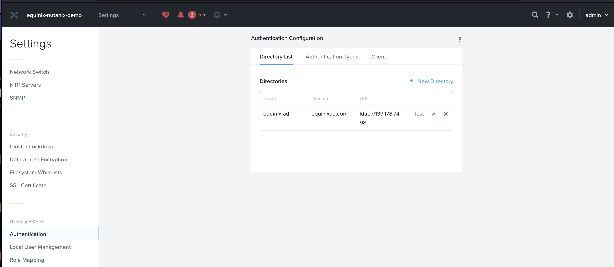
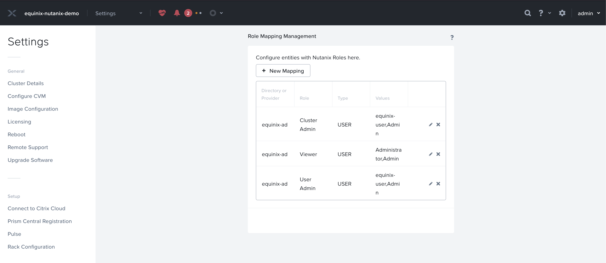
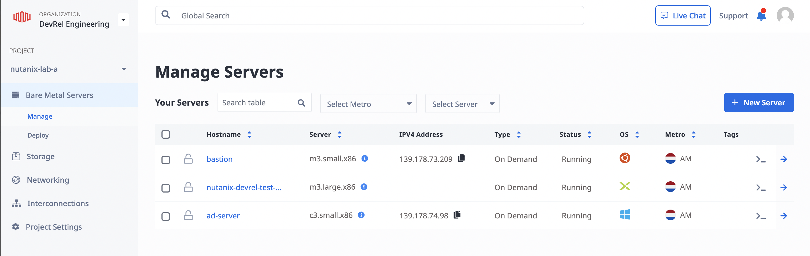

# Nutanix on Equinix Metal with Active Directory Authentication

## Introduction

Nutanix Prism allows using Windows Active Directory as an authentication mode.
This example will help:

- Create nutanix prism cluster on equinix
- An AD server VM
- AD authentication configured on Equnix
- A few roles mapped to the AD with `Cluster Admin` and `User Admin`

The example is almost automated but needs to setup prism central manually.

## Prerequisites

- [Terraform installed](https://developer.hashicorp.com/terraform/install)
- [Equinix Metal account](https://deploy.equinix.com/developers/docs/metal/identity-access-management/users/) with an [API key](https://deploy.equinix.com/developers/docs/metal/identity-access-management/api-keys/).
- SSH key pair for accessing the Nutanix clusters or

you can reuse the SSH private key generated by the example with the name prefix `ssh-key-xxxxx` at Current lcoation.

### Clone the repository

 ```sh
 git clone git@github.com:equinix-labs/terraform-equinix-metal-nutanix-cluster.git
 cd terraform-equinix-metal-nutanix-cluster
 cd examples/nutanix-clusters
 ```

## How to use the module

To create a setup of nutanix prism clusters with an AD server and AD authentication on prism element, we need to run this example module and follow the further steps to configure prism central.

### **Provide TF variables to the module**

If you have the [Metal CLI](https://deploy.equinix.com/developers/docs/metal/libraries/cli/) configured, the following will setup your authentication and project settings in an OSX or Linux shell environment.

```sh
eval $(metal env -o terraform --export) #
export TF_VAR_metal_metro=sl # Deploy to Seoul
```

Otherwise, copy [`terraform.tfvars.example`](../../terraform.tfvars.example) to `terraform.tfvars` and edit the input values before continuing.

#### The file will look like below

```hcl
 metal_project_id       = "XXXX-XXXX-XXXX-XXXXXX-XXXXX"
 metal_organization_id  = "XXXX-XXXX-XXXX-XXXXXX-XXXXX" # The ID of the Metal organization in which to create the project if `create_project` is true.
 metal_metro            = "sl"                                   # The metro to create the cluster in
 create_project         = false                                  # (Optional) to use an existing project matching `metal_project_name`, set this to false.
 metal_bastion_plan     = "m3.small.x86"                         # Which plan to use for the bastion host.
 metal_nutanix_os       = "nutanix_lts_6_5"                      # Which OS to use for the Nutanix nodes.
 metal_nutanix_plan     = "m3.large.x86"                         # Which plan to use for the Nutanix nodes (must be Nutanix compatible, see https://deploy.equinix.com/developers/os-compatibility/)
 create_vlan            = false                                  # Whether to create a new VLAN for this project.
 create_vrf             = true
 metal_vlan_id          = null # ID of the VLAN you wish to use. e.g. 1234
 nutanix_node_count    = 1                 # The number of Nutanix nodes to create.
 skip_cluster_creation = false             # Skip the creation of the Nutanix cluster.
 cluster_subnet        = "192.168.96.0/21" # Pick an arbitrary private subnet, we recommend a /22 like "192.168.100.0/22"
 nutanix_reservation_ids=[] # Hardware reservation IDs to use for the Nutanix nodes
 ```

There are a few variables from above for which, if the values are not passed into them, this module will try to create the new instance of the same:

- `metal_project_id`: If not passed a new metal project will be created. This should work in conjunction with value of `create_project`. If `create_project == false` and `metal_project_id` is not passed, its an error.
- `metal_vlan_id`: If not passed a new metal vlan will be created. This should work in conjunction with value of `create_vlan`. If `create_vlan == false` and `metal_vlan_id` is not passed, its an error.
- `vrf_id`: If not passed a new metal vrf will be created. This should work in conjunction with value of `create_vrf`. If `create_vrf == false` and `vrf_id` is not passed, its an error.

You need to provide a new password in the TF vars file which will be set to the Prism Element by changing the older default password `Nutanix/4u`.

### Apply the module

 ```sh
 terraform init
 terraform plan
 terraform apply
 ```

### A successful response will look like

 ```sh
 Outputs:
 prism_central_ip_address = "192.168.103.252"
 bastion_public_ip = "145.40.91.141"
 ssh_forward_command = "ssh -L 9442:192.168.102.176:9440 -L 19442:192.168.103.252:9440 -i /Users/vasubabu/Equinix/terraform-equinix-metal-nutanix-cluster/examples/nutanix-clusters/ssh-key-lha20 root@145.40.91.141"
 ad_server_ip = "192.168.103.254"
 ```

### A Prism Cluster is successfully configured with an Active Directory



### Roles mapped to the ad server



### We have a Running Equinix Devices representing Prism Cluster and an AD Server**



## To Login to the Prism GUI

- SSH port forward session with the bastion host:

  **Mac or Linux**

  ```sh
  $(terraform output -raw ssh_forward_command)
  ```

  **Windows**

  ```sh
  invoke-expression $(terraform output -raw ssh_forward_command)
  ```

- Then open a browser and navigate to <https://localhost:9440> (the certificate will not match the domain)

To login, you can use credentials

- **Username** : The default username: `admin` or `Admin@equinixad.com` as the user from AD Server.
- **Password** : Password is the value provided in TF Vars (`terraform.tfvars`) file with the key `new_prism_password`.

### Now, you can try out with configured AD users on the Prism Element

- By default, The user `Admin` already mapped on the prism with Cluster Admin and User Admin roles.

To login to the prism ui, follow the steps as mentioned [here](./README.md#to-login-to-the-prism-gui).

Make sure you add domain as well to the username of the prism ex: `admin@equinixad.com`

### To support more users login

For more users, you can add a user/group to AD Server.

- RDP into the `ad-server` metal device/VM.
- Add more users and groups to AD.

```powershell
New-ADUser user01`
-Surname user01 `
-GivenName user01 `
-DisplayName "AD User01" `
-EmailAddress "user01@equinixad.com" `
-AccountPassword (ConvertTo-SecureString -AsPlainText "<password_here>" -Force) `
-ChangePasswordAtLogon $true `
-Enabled $true
```

Please refer [here](https://www.server-world.info/en/note?os=Windows_Server_2022&p=active_directory&f=4) for more details

- And Then add role_mappings for those users in Prism Element. From Prism Web console > Settings > Role Mapping.

Follow [this](https://portal.nutanix.com/page/documents/details?targetId=Nutanix-Security-Guide-v6_8:wc-security-role-permissions-wc-t.html) guide for detailed steps.

## Next Steps, Setup the Prism Central instance (Optional)

### To get more powerful capabilities of Nutanix, setup prism central

1. **Login Prism UI**

   Using the steps above [here](./README.md#to-login-to-the-prism-gui) login to Prism Element UI.

   Note: Remember to use the new password set in the `terraform.tfvars` file as it was reset by this module.

2. **Follow these instructions from the workshop to configure**

   [Nutanix Prism Cluster on Equinix Metal](https://equinix-labs.github.io/nutanix-on-equinix-metal-workshop/parts/5-prism_central/#part-5-deploy-prism-central)

**These steps will guide you through the configuration of VirtualIP, ISCSI IP, NTP Servers and deploying Prism Central Instance.**

<!-- BEGIN_TF_DOCS -->
## Requirements

| Name | Version |
|------|---------|
| <a name="requirement_terraform"></a> [terraform](#requirement\_terraform) | >= 1.0 |
| <a name="requirement_equinix"></a> [equinix](#requirement\_equinix) | >= 1.30 |
| <a name="requirement_null"></a> [null](#requirement\_null) | >= 3 |

## Providers

| Name | Version |
|------|---------|
| <a name="provider_equinix"></a> [equinix](#provider\_equinix) | >= 1.30 |
| <a name="provider_null"></a> [null](#provider\_null) | >= 3 |

## Modules

| Name | Source | Version |
|------|--------|---------|
| <a name="module_nutanix_cluster"></a> [nutanix\_cluster](#module\_nutanix\_cluster) | ../.. | n/a |

## Resources

| Name | Type |
|------|------|
| [equinix_metal_device.ad_server](https://registry.terraform.io/providers/equinix/equinix/latest/docs/resources/metal_device) | resource |
| [equinix_metal_port.ad_server_bond0](https://registry.terraform.io/providers/equinix/equinix/latest/docs/resources/metal_port) | resource |
| [null_resource.bastion_ssh](https://registry.terraform.io/providers/hashicorp/null/latest/docs/resources/resource) | resource |
| [null_resource.change_default_password](https://registry.terraform.io/providers/hashicorp/null/latest/docs/resources/resource) | resource |
| [equinix_metal_vlan.nutanix](https://registry.terraform.io/providers/equinix/equinix/latest/docs/data-sources/metal_vlan) | data source |

## Inputs

| Name | Description | Type | Default | Required |
|------|-------------|------|---------|:--------:|
| <a name="input_ad_password"></a> [ad\_password](#input\_ad\_password) | New Password to set on AD | `string` | n/a | yes |
| <a name="input_metal_auth_token"></a> [metal\_auth\_token](#input\_metal\_auth\_token) | Equinix Metal API token. | `string` | n/a | yes |
| <a name="input_metal_metro"></a> [metal\_metro](#input\_metal\_metro) | The metro to create the cluster in. | `string` | n/a | yes |
| <a name="input_new_prism_password"></a> [new\_prism\_password](#input\_new\_prism\_password) | New Password to set on Prism element and prism central | `string` | n/a | yes |
| <a name="input_ad_domain"></a> [ad\_domain](#input\_ad\_domain) | Domain Name to set on Active Directory configuration | `string` | `"equinixad.com"` | no |
| <a name="input_create_project"></a> [create\_project](#input\_create\_project) | (Optional) to use an existing project matching `metal_project_name`, set this to false. | `bool` | `true` | no |
| <a name="input_create_vlan"></a> [create\_vlan](#input\_create\_vlan) | Whether to create a new VLAN for this project. | `bool` | `true` | no |
| <a name="input_metal_ad_server_plan"></a> [metal\_ad\_server\_plan](#input\_metal\_ad\_server\_plan) | Which plan to use for the Active Directory Windows Server | `string` | `"c3.small.x86"` | no |
| <a name="input_metal_bastion_plan"></a> [metal\_bastion\_plan](#input\_metal\_bastion\_plan) | Which plan to use for the bastion host. | `string` | `"m3.small.x86"` | no |
| <a name="input_metal_nutanix_os"></a> [metal\_nutanix\_os](#input\_metal\_nutanix\_os) | Which OS to use for the Nutanix nodes. | `string` | `"nutanix_lts_6_5"` | no |
| <a name="input_metal_nutanix_plan"></a> [metal\_nutanix\_plan](#input\_metal\_nutanix\_plan) | Which plan to use for the Nutanix nodes (must be Nutanix compatible, see https://deploy.equinix.com/developers/os-compatibility/) | `string` | `"m3.large.x86"` | no |
| <a name="input_metal_organization_id"></a> [metal\_organization\_id](#input\_metal\_organization\_id) | The ID of the Metal organization in which to create the project if `create_project` is true. | `string` | `null` | no |
| <a name="input_metal_project_id"></a> [metal\_project\_id](#input\_metal\_project\_id) | The ID of the Metal project in which to deploy to cluster. If `create_project` is false and<br>  you do not specify a project name, the project will be looked up by ID. One (and only one) of<br>  `metal_project_name` or `metal_project_id` is required or `metal_project_id` must be set. | `string` | `""` | no |
| <a name="input_metal_project_name"></a> [metal\_project\_name](#input\_metal\_project\_name) | The name of the Metal project in which to deploy the cluster. If `create_project` is false and<br>  you do not specify a project ID, the project will be looked up by name. One (and only one) of<br>  `metal_project_name` or `metal_project_id` is required or `metal_project_id` must be set.<br>  Required if `create_project` is true. | `string` | `""` | no |
| <a name="input_metal_vlan_description"></a> [metal\_vlan\_description](#input\_metal\_vlan\_description) | Description to add to created VLAN. | `string` | `"ntnx-demo"` | no |
| <a name="input_metal_vlan_id"></a> [metal\_vlan\_id](#input\_metal\_vlan\_id) | ID of the VLAN you wish to use. | `number` | `null` | no |
| <a name="input_nutanix_node_count"></a> [nutanix\_node\_count](#input\_nutanix\_node\_count) | The number of Nutanix nodes to create. | `number` | `1` | no |
| <a name="input_nutanix_reservation_ids"></a> [nutanix\_reservation\_ids](#input\_nutanix\_reservation\_ids) | Hardware reservation IDs to use for the Nutanix nodes. If specified, the length of this list must<br>  be the same as `nutanix_node_count`.  Each item can be a reservation UUID or `next-available`. If<br>  you use reservation UUIDs, make sure that they are in the same metro specified in `metal_metro`. | `list(string)` | `[]` | no |
| <a name="input_skip_cluster_creation"></a> [skip\_cluster\_creation](#input\_skip\_cluster\_creation) | Skip the creation of the Nutanix cluster. | `bool` | `false` | no |

## Outputs

| Name | Description |
|------|-------------|
| <a name="output_ad_server_ip"></a> [ad\_server\_ip](#output\_ad\_server\_ip) | IP Address of the Windows Active Directory Server initialised by this module |
| <a name="output_bastion_public_ip"></a> [bastion\_public\_ip](#output\_bastion\_public\_ip) | The public IP address of the bastion host |
| <a name="output_prism_central_ip_address"></a> [prism\_central\_ip\_address](#output\_prism\_central\_ip\_address) | Reserved IP for Prism Central VM |
| <a name="output_ssh_forward_command"></a> [ssh\_forward\_command](#output\_ssh\_forward\_command) | SSH port forward command to use to connect to the Prism GUI |
<!-- END_TF_DOCS -->