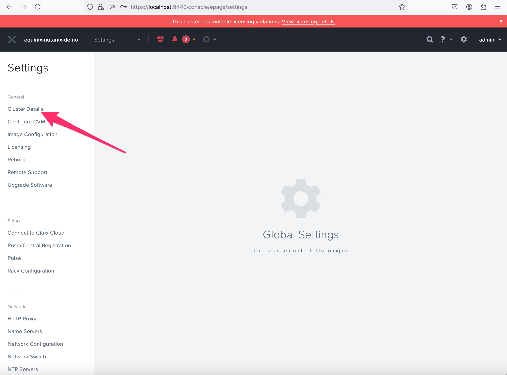
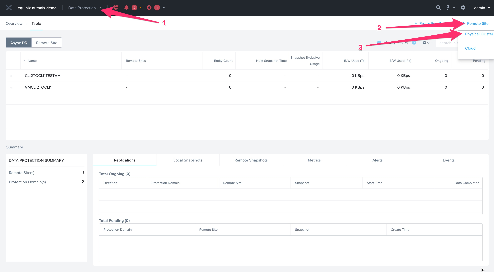
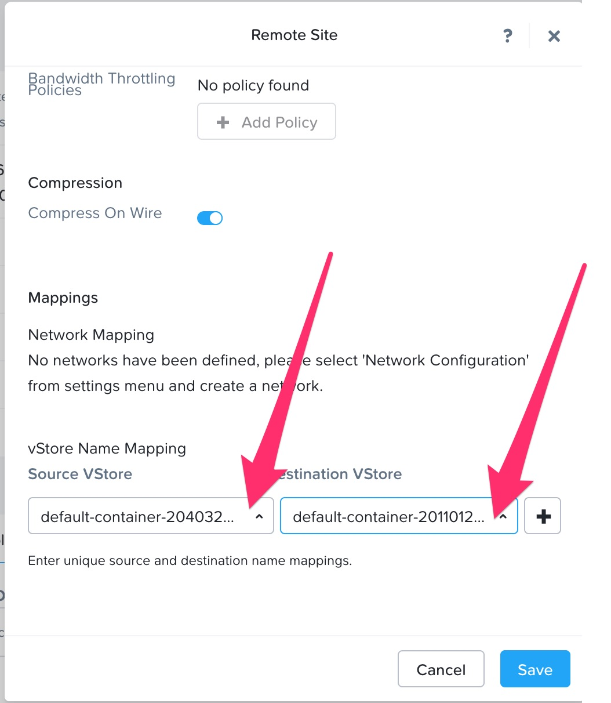
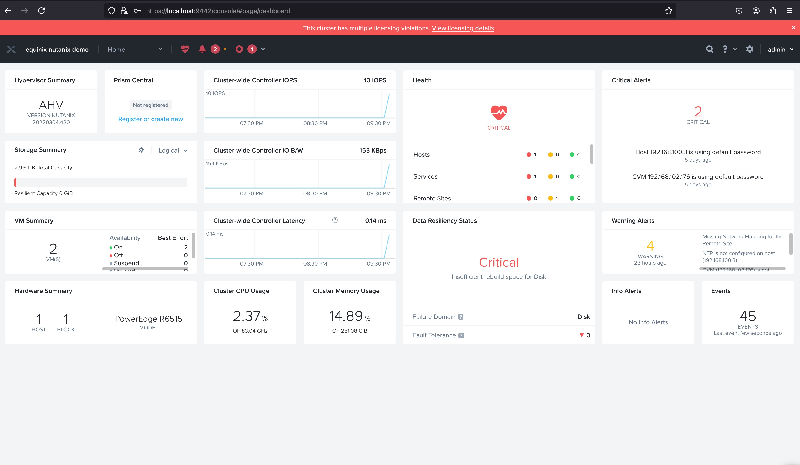
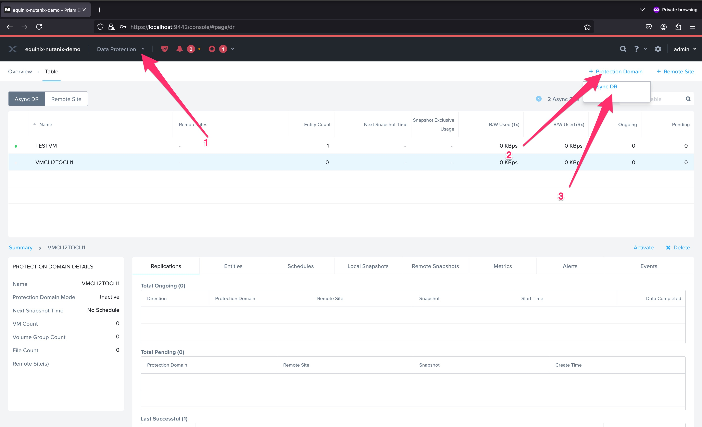
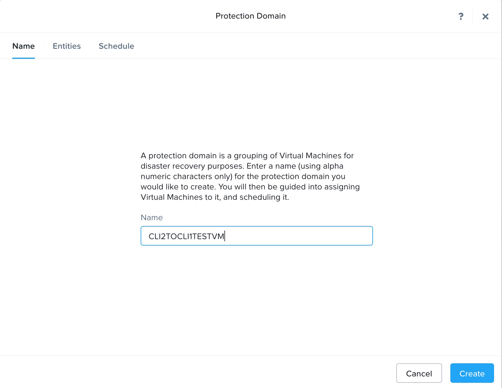
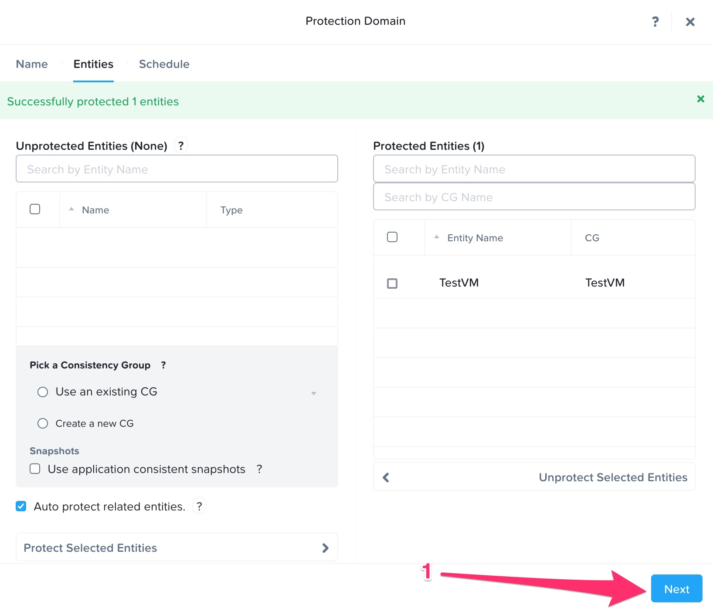
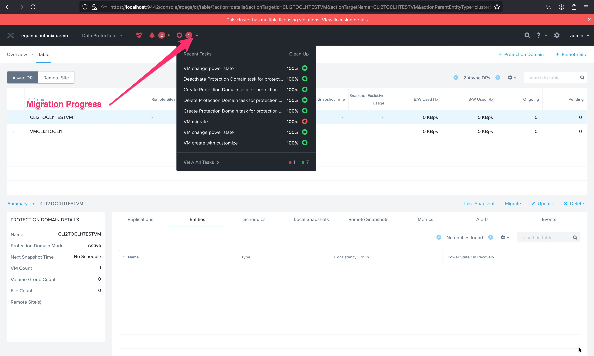

# Nutanix Clusters Setup and Protection Policy Example

## Overview

This example demonstrates how to create two Nutanix clusters and set up a protection policy between them. Additionally, it covers the process of creating a VM in one cluster and migrating it to the other. The setup is partially automated using Terraform and partially manual.

## Prerequisites

- Terraform installed on your local machine
- Equinix Metal account
- SSH key pair for accessing the Nutanix clusters

## Automated Steps

1. **Create two Nutanix clusters**

    1.1. Clone the repository:

    ```sh
    git clone git@github.com:equinix-labs/terraform-equinix-metal-nutanix-cluster.git
    cd terraform-equinix-metal-nutanix-cluster
    cd examples/nutanix-clusters
    ```

    1.2. Create the `terraform.tfvars` file:

    ```hcl
    metal_auth_token       = ""                               # Equinix Metal API token
    metal_project_id       = ""                               # The ID of the Metal project in which to deploy to cluster if `create_project` is false.
    metal_organization_id  = ""                               # The ID of the Metal organization in which to create the project if `create_project` is true.
    metal_metro            = "sl"                             # The metro to create the cluster in
    create_project         = false                            # (Optional) to use an existing project matching `metal_project_name`, set this to false.
    create_vlan            = false                            # Whether to create a new VLAN for this project.
    create_vrf             = true
    nutanix_node_count    = 1                                 # The number of Nutanix nodes to create. It should be odd number like 1, 3, 5..
    metal_subnet        = "192.168.96.0/21"                   # Pick an arbitrary private subnet, we recommend a /21 like "192.168.96.0/21"
    nutanix_reservation_ids=[]                                # Hardware reservation IDs to use for the Nutanix nodes
    ```

    1.3. Initialize and apply Terraform:

    ```sh
    terraform init
    terraform plan
    terraform apply
    ```

    1.4. Network Topology:

    ```mermaid
    graph TD
    Internet[Internet 🌐]

    A[Common VRF: 192.168.96.0/21]

    subgraph ClusterA["Cluster A"]
        direction TB
        A1[VLAN A]
        A2[VRF IP Reservation: 192.168.96.0/22]
        A3[Gateway A]
        A4[Bastion A ＜DHCP,NTP,NAT＞]
        A5[Nutanix Nodes A]
    end

    subgraph ClusterB["Cluster B"]
        direction TB
        B1[VLAN B]
        B2[VRF IP Reservation: 192.168.100.0/22]
        B3[Gateway B]
        B4[Bastion B ＜DHCP,NTP,NAT＞]
        B5[Nutanix Nodes B]
    end

    A -->|192.168.96.0/22| A1
    A1 --> A2
    A2 --> A3
    A3 --> A4
    A4 --> A5
    A -->|192.168.100.0/22| B1
    B1 --> B2
    B2 --> B3
    B3 --> B4
    B4 --> B5

    Internet --> A4
    Internet --> B4
    ```

    1.5. After a successful run, the expected output is:

    ```console
    Outputs:

    nutanix_cluster1_bastion_public_ip = "145.40.91.33"
    nutanix_cluster1_cvim_ip_address = "192.168.97.57"
    nutanix_cluster1_iscsi_data_services_ip = "192.168.99.253"
    nutanix_cluster1_prism_central_ip_address = "192.168.99.252"
    nutanix_cluster1_ssh_forward_command = "ssh -L 9440:192.168.97.57:9440 -L 19440:192.168.99.252:9440 -i /Users/username/terraform-equinix-metal-nutanix-cluster/examples/nutanix-clusters/ssh-key-qh0f2 root@145.40.91.33"
    nutanix_cluster1_ssh_private_key = "/Users/example/terraform-equinix-metal-nutanix-cluster/examples/nutanix-clusters/ssh-key-qh0f2"
    nutanix_cluster1_virtual_ip_address = "192.168.99.254"

    nutanix_cluster2_bastion_public_ip = "145.40.91.141"
    nutanix_cluster2_cvim_ip_address = "192.168.102.176"
    nutanix_cluster2_iscsi_data_services_ip = "192.168.103.253"
    nutanix_cluster2_prism_central_ip_address = "192.168.103.252"
    nutanix_cluster2_ssh_forward_command = "ssh -L 9442:192.168.102.176:9440 -L 19442:192.168.103.252:9440 -i /Users/example/Equinix/terraform-equinix-metal-nutanix-cluster/examples/nutanix-clusters/ssh-key-lha20 root@145.40.91.141"
    nutanix_cluster2_ssh_private_key = "/Users/example/Equinix/terraform-equinix-metal-nutanix-cluster/examples/nutanix-clusters/ssh-key-lha20"
    nutanix_cluster2_virtual_ip_address = "192.168.103.254"
    ```

## Manual Steps

1. **Set up network resources to connect the clusters**

    Let's start by simplifying how we access the Terraform outputs from the previous step. We'll make heavy use of these outputs as variables in the following steps.

    ```sh
    terraform output | wc -l
    grep -c output\ \" outputs.tf
    ```

    If you didn't reach a successful deployment in the previous steps, you will be missing variables needed in the following steps. If the following command doesn't show the same number twice, please check the known issues before moving ahead.

    Now export the outputs to their own shell environment variables. Keep in mind, these variables are only available where you ran Terraform, not within the bastion or Nutanix nodes.

    ```sh
    eval $(terraform output | sed 's/ = /=/')
    ```

    1.1. Access Cluster 1:

    ```sh
    ssh -L 9440:$nutanix_cluster1_cvim_ip_address:9440 \
        -L 19440:$nutanix_cluster1_prism_central_ip_address:9440 \
        -i $nutanix_cluster1_ssh_private_key \
        root@$nutanix_cluster1_bastion_public_ip
    ```
    OR
    ```sh
    $(terraform output -raw nutanix_cluster1_ssh_forward_command)
    ```

    1.2. Follow the instructions to change the password of Cluster 1:
    [Nutanix Metal Workshop - Access Prism UI](https://equinix-labs.github.io/nutanix-on-equinix-metal-workshop/parts/3-access_prism_ui/)

    1.3. Access Cluster 2:

    ```sh
    ssh -L 9440:$nutanix_cluster2_cvim_ip_address:9440 \
        -L 19440:$nutanix_cluster2_prism_central_ip_address:9440 \
        -i $nutanix_cluster2_ssh_private_key \
        root@$nutanix_cluster2_bastion_public_ip
    ```
    OR
    ```sh
    $(terraform output -raw nutanix_cluster2_ssh_forward_command)
    ```

    1.4. Follow the instructions to change the password of Cluster 2:
    [Nutanix Metal Workshop - Access Prism UI](https://equinix-labs.github.io/nutanix-on-equinix-metal-workshop/parts/3-access_prism_ui/)

    1.5. Add a route to establish connectivity between the two clusters:

    1.5.1. On Cluster 1:

    ```sh
    ssh -L 9440:$nutanix_cluster1_cvim_ip_address:9440 \
        -L 19440:$nutanix_cluster1_cvim_ip_address:9440 \
        -i $nutanix_cluster1_ssh_private_key \
        -J root@$nutanix_cluster1_bastion_public_ip \
        admin@$nutanix_cluster1_cvim_ip_address
    sudo ip route add 192.168.100.0/22 via 192.168.96.1
    ```

    1.5.2. On Cluster 2:

    ```sh
    ssh -L 9440:$nutanix_cluster2_cvim_ip_address:9440 \
        -L 19440:$nutanix_cluster2_cvim_ip_address:9440 \
        -i $nutanix_cluster2_ssh_private_key \
        -J root@$nutanix_cluster2_bastion_public_ip \
        admin@$nutanix_cluster2_cvim_ip_address
    sudo ip route add 192.168.96.0/22 via 192.168.100.1
    ```

    **Note:** It is recommended to use Cluster 1 in a normal window and Cluster 2 in an incognito window.

2. **Update Cluster Details**

    2.1. Update on Cluster 1:
    Click on the gear icon in the upper right corner of the Prism UI. Then choose Cluster Details and enter `192.168.99.254` for the Virtual IP and `192.168.99.253` for the ISCSI Data Services IP and click Save.

    2.2. Update on Cluster 2:
    Click on the gear icon in the upper right corner of the Prism UI. Then choose Cluster Details and enter `192.168.103.254` for the Virtual IP and `192.168.102.176` for the ISCSI Data Services IP and click Save.

    
    

3. **Setup Remote Site On both Clusters**

    

    Navigate to the top-right, click on `+ Remote Site`, and select `Physical Cluster`.

    

    Navigate to the next pop-up window.

    

4. **Create a Virtual Machine on any one Cluster**

    [Nutanix Metal Workshop - Create A VM](https://equinix-labs.github.io/nutanix-on-equinix-metal-workshop/parts/4-create_a_vm/)

5. **Set up a protection policy between the clusters**

    5.1. Log in to Nutanix Prism Central.
    

    5.2. Navigate to the Data Protection section and create a new Protection Domain.
    
    
    
    
    

6. **Migrate the VM to the other cluster**

    6.1. Log in to Nutanix Prism Central.
    

    6.2. Migrate the VM.
    
    

    After migration is initiated, it will take a while. You can see the progress in recent tasks.
    
    

<!-- TEMPLATE: The following block has been generated by terraform-docs util: https://github.com/terraform-docs/terraform-docs -->
<!-- BEGIN_TF_DOCS -->
## Requirements

| Name | Version |
|------|---------|
| <a name="requirement_terraform"></a> [terraform](#requirement\_terraform) | >= 1.0 |
| <a name="requirement_equinix"></a> [equinix](#requirement\_equinix) | >= 1.30 |
| <a name="requirement_local"></a> [local](#requirement\_local) | >= 2.5 |
| <a name="requirement_null"></a> [null](#requirement\_null) | >= 3 |
| <a name="requirement_random"></a> [random](#requirement\_random) | >= 3 |

## Providers

| Name | Version |
|------|---------|
| <a name="provider_equinix"></a> [equinix](#provider\_equinix) | >= 1.30 |
| <a name="provider_random"></a> [random](#provider\_random) | >= 3 |

## Modules

| Name | Source | Version |
|------|--------|---------|
| <a name="module_nutanix_cluster1"></a> [nutanix\_cluster1](#module\_nutanix\_cluster1) | ../.. | n/a |
| <a name="module_nutanix_cluster2"></a> [nutanix\_cluster2](#module\_nutanix\_cluster2) | ../.. | n/a |

## Resources

| Name | Type |
|------|------|
| [equinix_metal_project.nutanix](https://registry.terraform.io/providers/equinix/equinix/latest/docs/resources/metal_project) | resource |
| [equinix_metal_vrf.nutanix](https://registry.terraform.io/providers/equinix/equinix/latest/docs/resources/metal_vrf) | resource |
| [random_string.vrf_name_suffix](https://registry.terraform.io/providers/hashicorp/random/latest/docs/resources/string) | resource |
| [equinix_metal_project.nutanix](https://registry.terraform.io/providers/equinix/equinix/latest/docs/data-sources/metal_project) | data source |
| [equinix_metal_vrf.nutanix](https://registry.terraform.io/providers/equinix/equinix/latest/docs/data-sources/metal_vrf) | data source |

## Inputs

| Name | Description | Type | Default | Required |
|------|-------------|------|---------|:--------:|
| <a name="input_metal_auth_token"></a> [metal\_auth\_token](#input\_metal\_auth\_token) | Equinix Metal API token. | `string` | n/a | yes |
| <a name="input_metal_metro"></a> [metal\_metro](#input\_metal\_metro) | The metro to create the cluster in. | `string` | n/a | yes |
| <a name="input_create_project"></a> [create\_project](#input\_create\_project) | (Optional) to use an existing project matching `metal_project_name`, set this to false. | `bool` | `true` | no |
| <a name="input_create_vlan"></a> [create\_vlan](#input\_create\_vlan) | Whether to create a new VLAN for this project. | `bool` | `true` | no |
| <a name="input_create_vrf"></a> [create\_vrf](#input\_create\_vrf) | Whether to create a new VRF for this project. | `bool` | `true` | no |
| <a name="input_metal_organization_id"></a> [metal\_organization\_id](#input\_metal\_organization\_id) | The ID of the Metal organization in which to create the project if `create_project` is true. | `string` | `null` | no |
| <a name="input_metal_project_id"></a> [metal\_project\_id](#input\_metal\_project\_id) | The ID of the Metal project in which to deploy to cluster. If `create_project` is false and<br>  you do not specify a project name, the project will be looked up by ID. One (and only one) of<br>  `metal_project_name` or `metal_project_id` is required or `metal_project_id` must be set. | `string` | `""` | no |
| <a name="input_metal_project_name"></a> [metal\_project\_name](#input\_metal\_project\_name) | The name of the Metal project in which to deploy the cluster. If `create_project` is false and<br>you do not specify a project ID, the project will be looked up by name. One (and only one) of<br>`metal_project_name` or `metal_project_id` is required or `metal_project_id` must be set.<br>Required if `create_project` is true. | `string` | `""` | no |
| <a name="input_metal_subnet"></a> [metal\_subnet](#input\_metal\_subnet) | IP pool for all Nutanix Clusters in the example. One bit will be appended to the end and divided between example clusters. (192.168.96.0/21 will result in clusters with ranges 192.168.96.0/22 and 192.168.100.0/22) | `string` | `"192.168.96.0/21"` | no |
| <a name="input_metal_vlan_id"></a> [metal\_vlan\_id](#input\_metal\_vlan\_id) | ID of the VLAN you wish to use. | `number` | `null` | no |
| <a name="input_nutanix_node_count"></a> [nutanix\_node\_count](#input\_nutanix\_node\_count) | The number of Nutanix nodes to create. | `number` | `2` | no |
| <a name="input_vrf_id"></a> [vrf\_id](#input\_vrf\_id) | ID of the VRF you wish to use. | `string` | `null` | no |

## Outputs

| Name | Description |
|------|-------------|
| <a name="output_nutanix_cluster1_bastion_public_ip"></a> [nutanix\_cluster1\_bastion\_public\_ip](#output\_nutanix\_cluster1\_bastion\_public\_ip) | The public IP address of the bastion host |
| <a name="output_nutanix_cluster1_cluster_gateway"></a> [nutanix\_cluster1\_cluster\_gateway](#output\_nutanix\_cluster1\_cluster\_gateway) | The Nutanix cluster gateway IP |
| <a name="output_nutanix_cluster1_cvim_ip_address"></a> [nutanix\_cluster1\_cvim\_ip\_address](#output\_nutanix\_cluster1\_cvim\_ip\_address) | The IP address of the CVM |
| <a name="output_nutanix_cluster1_iscsi_data_services_ip"></a> [nutanix\_cluster1\_iscsi\_data\_services\_ip](#output\_nutanix\_cluster1\_iscsi\_data\_services\_ip) | Reserved IP for cluster ISCSI Data Services IP |
| <a name="output_nutanix_cluster1_prism_central_ip_address"></a> [nutanix\_cluster1\_prism\_central\_ip\_address](#output\_nutanix\_cluster1\_prism\_central\_ip\_address) | Reserved IP for Prism Central VM |
| <a name="output_nutanix_cluster1_ssh_forward_command"></a> [nutanix\_cluster1\_ssh\_forward\_command](#output\_nutanix\_cluster1\_ssh\_forward\_command) | SSH port forward command to use to connect to the Prism GUI |
| <a name="output_nutanix_cluster1_ssh_private_key"></a> [nutanix\_cluster1\_ssh\_private\_key](#output\_nutanix\_cluster1\_ssh\_private\_key) | The SSH keypair's private key for cluster1 |
| <a name="output_nutanix_cluster1_virtual_ip_address"></a> [nutanix\_cluster1\_virtual\_ip\_address](#output\_nutanix\_cluster1\_virtual\_ip\_address) | Reserved IP for cluster virtal IP |
| <a name="output_nutanix_cluster2_bastion_public_ip"></a> [nutanix\_cluster2\_bastion\_public\_ip](#output\_nutanix\_cluster2\_bastion\_public\_ip) | The public IP address of the bastion host |
| <a name="output_nutanix_cluster2_cluster_gateway"></a> [nutanix\_cluster2\_cluster\_gateway](#output\_nutanix\_cluster2\_cluster\_gateway) | The Nutanix cluster gateway IP |
| <a name="output_nutanix_cluster2_cvim_ip_address"></a> [nutanix\_cluster2\_cvim\_ip\_address](#output\_nutanix\_cluster2\_cvim\_ip\_address) | The IP address of the CVM |
| <a name="output_nutanix_cluster2_iscsi_data_services_ip"></a> [nutanix\_cluster2\_iscsi\_data\_services\_ip](#output\_nutanix\_cluster2\_iscsi\_data\_services\_ip) | Reserved IP for cluster ISCSI Data Services IP |
| <a name="output_nutanix_cluster2_prism_central_ip_address"></a> [nutanix\_cluster2\_prism\_central\_ip\_address](#output\_nutanix\_cluster2\_prism\_central\_ip\_address) | Reserved IP for Prism Central VM |
| <a name="output_nutanix_cluster2_ssh_forward_command"></a> [nutanix\_cluster2\_ssh\_forward\_command](#output\_nutanix\_cluster2\_ssh\_forward\_command) | SSH port forward command to use to connect to the Prism GUI |
| <a name="output_nutanix_cluster2_ssh_private_key"></a> [nutanix\_cluster2\_ssh\_private\_key](#output\_nutanix\_cluster2\_ssh\_private\_key) | The SSH keypair's private key for cluster1 |
| <a name="output_nutanix_cluster2_virtual_ip_address"></a> [nutanix\_cluster2\_virtual\_ip\_address](#output\_nutanix\_cluster2\_virtual\_ip\_address) | Reserved IP for cluster virtal IP |
<!-- END_TF_DOCS -->