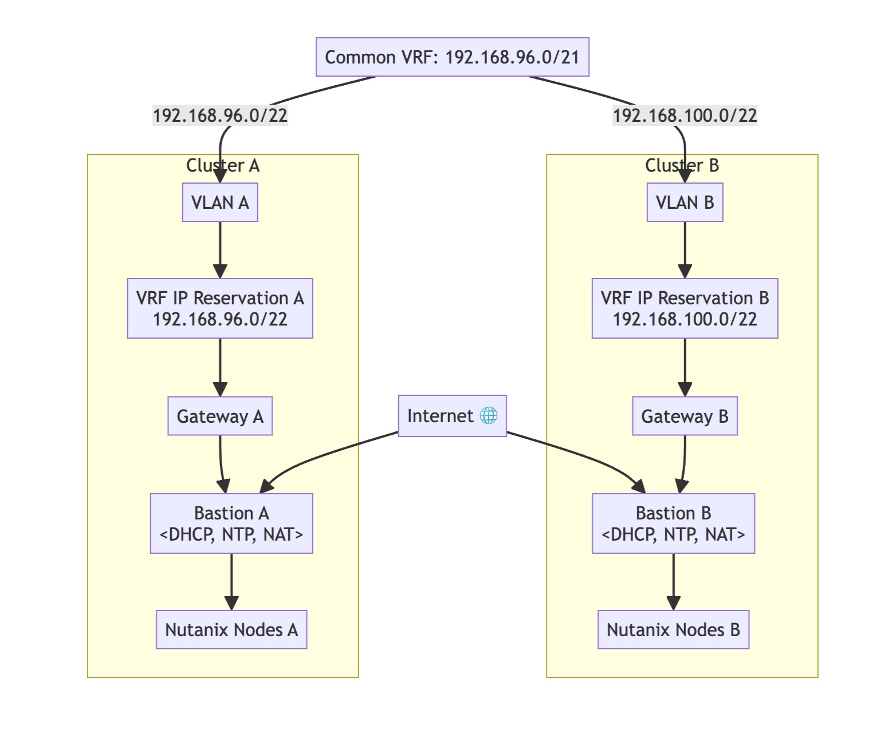

# Nutanix Clusters Setup and Protection Policy Example

## Overview

This example demonstrates how to create two Nutanix clusters and set up a protection policy between them. Additionally, it covers the process of creating a VM in one cluster and migrating it to the other. The setup is partially automated using Terraform and partially manual.

## Prerequisites

- Terraform installed on your local machine
- Equinix Metal account
- SSH key pair for accessing the Nutanix clusters

## Automated Steps

1. **Create two Nutanix clusters**

    1.1. Clone the repository:

    ```sh
    git clone git@github.com:equinix-labs/terraform-equinix-metal-nutanix-cluster.git
    cd terraform-equinix-metal-nutanix-cluster
    cd examples/nutanix-clusters
    ```

    1.2. Create the `terraform.tfvars` file:

    ```hcl
    metal_project_id       = "XXXXXXXXXXXXXXXXXXXXXXX"
    metal_organization_id  = "XXXXXXXXXXXXXXXXXXXXXXX" # The ID of the Metal organization in which to create the project if `create_project` is true.
    metal_metro            = "sl"                                   # The metro to create the cluster in
    create_project         = false                                  # (Optional) to use an existing project matching `metal_project_name`, set this to false.
    metal_bastion_plan     = "m3.small.x86"                         # Which plan to use for the bastion host.
    metal_nutanix_os       = "nutanix_lts_6_5"                      # Which OS to use for the Nutanix nodes.
    metal_nutanix_plan     = "m3.large.x86"                         # Which plan to use for the Nutanix nodes (must be Nutanix compatible, see https://deploy.equinix.com/developers/os-compatibility/)
    create_vlan            = false                                  # Whether to create a new VLAN for this project.
    create_vrf             = true
    # metal_vlan_id=null # ID of the VLAN you wish to use. e.g. 1234
    nutanix_node_count    = 1                 # The number of Nutanix nodes to create.
    skip_cluster_creation = false             # Skip the creation of the Nutanix cluster.
    cluster_subnet        = "192.168.96.0/21" # Pick an arbitrary private subnet, we recommend a /22 like "192.168.100.0/22"
    # nutanix_reservation_ids=[] # Hardware reservation IDs to use for the Nutanix nodes
    ```

    1.3. Initialize and apply Terraform:

    ```sh
    terraform init
    terraform plan
    terraform apply
    ```

    1.4. Network Topology:
    

    1.5. After a successful run, the expected output is:

    ```
    Outputs:

    nutanix_cluster1_bastion_public_ip = "145.40.91.33"
    nutanix_cluster1_cvim_ip_address = "192.168.97.57"
    nutanix_cluster1_iscsi_data_services_ip = "192.168.99.253"
    nutanix_cluster1_prism_central_ip_address = "192.168.99.252"
    nutanix_cluster1_ssh_forward_command = "ssh -L 9440:192.168.97.57:9440 -L 19440:192.168.99.252:9440 -i /Users/vasubabu/Equinix/terraform-equinix-metal-nutanix-cluster/examples/nutanix-clusters/ssh-key-qh0f2 root@145.40.91.33"
    nutanix_cluster1_ssh_private_key = "/Users/vasubabu/Equinix/terraform-equinix-metal-nutanix-cluster/examples/nutanix-clusters/ssh-key-qh0f2"
    nutanix_cluster1_virtual_ip_address = "192.168.99.254"

    nutanix_cluster2_bastion_public_ip = "145.40.91.141"
    nutanix_cluster2_cvim_ip_address = "192.168.102.176"
    nutanix_cluster2_iscsi_data_services_ip = "192.168.103.253"
    nutanix_cluster2_prism_central_ip_address = "192.168.103.252"
    nutanix_cluster2_ssh_forward_command = "ssh -L 9442:192.168.102.176:9440 -L 19442:192.168.103.252:9440 -i /Users/vasubabu/Equinix/terraform-equinix-metal-nutanix-cluster/examples/nutanix-clusters/ssh-key-lha20 root@145.40.91.141"
    nutanix_cluster2_ssh_private_key = "/Users/vasubabu/Equinix/terraform-equinix-metal-nutanix-cluster/examples/nutanix-clusters/ssh-key-lha20"
    nutanix_cluster2_virtual_ip_address = "192.168.103.254"
    ```

## Manual Steps

1. **Set up network resources to connect the clusters**

    1.1. Access Cluster 1:

    ```sh
    ssh -L 9440:192.168.97.57:9440 -L 19440:192.168.99.252:9440 -i /Users/vasubabu/Equinix/terraform-equinix-metal-nutanix-cluster/examples/nutanix-clusters/ssh-key-qh0f2 root@145.40.91.33
    ```

    1.2. Follow the instructions to change the password of Cluster 1:
    [Nutanix Metal Workshop - Access Prism UI](https://equinix-labs.github.io/nutanix-on-equinix-metal-workshop/parts/3-access_prism_ui/)

    1.3. Access Cluster 2:

    ```sh
    ssh -L 9442:192.168.102.176:9440 -L 19442:192.168.103.252:9440 -i /Users/vasubabu/Equinix/terraform-equinix-metal-nutanix-cluster/examples/nutanix-clusters/ssh-key-lha20 root@145.40.91.141
    ```

    1.4. Follow the instructions to change the password of Cluster 2:
    [Nutanix Metal Workshop - Access Prism UI](https://equinix-labs.github.io/nutanix-on-equinix-metal-workshop/parts/3-access_prism_ui/)

    1.5. Run the firewall rules to establish connectivity between the two clusters:

    1.5.1. On Cluster 1:

    ```sh
    ssh -L 9440:192.168.97.57:9440 -L 19440:192.168.99.252:9440 -i /Users/vasubabu/Equinix/terraform-equinix-metal-nutanix-cluster/examples/nutanix-clusters/ssh-key-qh0f2 root@145.40.91.33
    ssh admin@192.168.97.57
    sudo ip route add 192.168.100.0/22 via 192.168.96.1
    ```

    1.5.2. On Cluster 2:

    ```sh
    ssh -L 9442:192.168.102.176:9440 -L 19442:192.168.103.252:9440 -i /Users/vasubabu/Equinix/terraform-equinix-metal-nutanix-cluster/examples/nutanix-clusters/ssh-key-lha20 root@145.40.91.141
    ssh admin@192.168.102.176
    sudo ip route add 192.168.96.0/22 via 192.168.100.1
    ```

    **Note:** It is recommended to use Cluster 1 in a normal window and Cluster 2 in an incognito window.

2. **Update Cluster Details**

    2.1. Update on Cluster 1:
    Click on the gear icon in the upper right corner of the Prism UI. Then choose Cluster Details and enter `192.168.99.254` for the Virtual IP and `192.168.99.253` for the ISCSI Data Services IP and click Save.

    2.2. Update on Cluster 2:
    Click on the gear icon in the upper right corner of the Prism UI. Then choose Cluster Details and enter `192.168.103.254` for the Virtual IP and `192.168.102.176` for the ISCSI Data Services IP and click Save.

    
    

3. **Setup Remote Site On both Clusters**

    

    Navigate to the top-right, click on `+ Remote Site`, and select `Physical Cluster`.

    

    Navigate to the next pop-up window.

    

4. **Create a Virtual Machine on any one Cluster**

    [Nutanix Metal Workshop - Create A VM](https://equinix-labs.github.io/nutanix-on-equinix-metal-workshop/parts/4-create_a_vm/)

5. **Set up a protection policy between the clusters**

    5.1. Log in to Nutanix Prism Central.
    

    5.2. Navigate to the Data Protection section and create a new Protection Domain.
    
    
    
    
    

6. **Migrate the VM to the other cluster**

    6.1. Log in to Nutanix Prism Central.
    

    6.2. Migrate the VM.
    
    

    After migration is initiated, it will take a while. You can see the progress in recent tasks.
    
    
